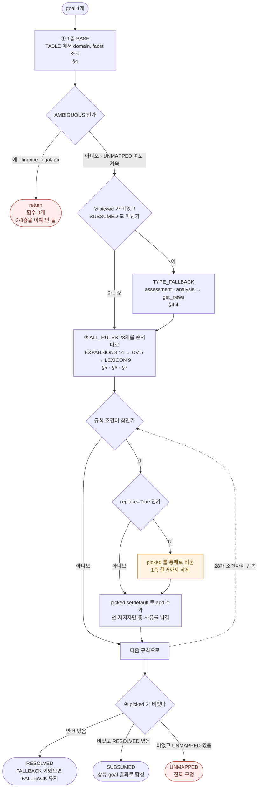
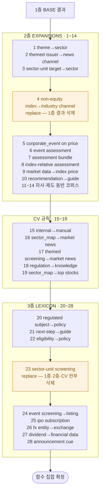
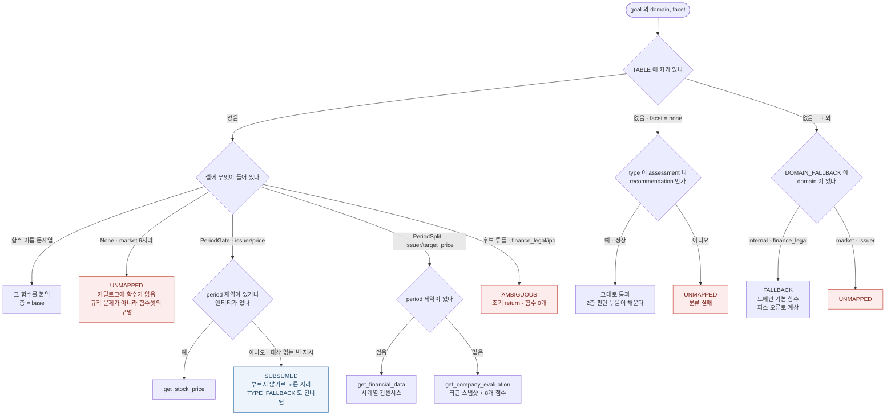

# 라우터 규칙 해설 — `route.py` 를 판정 가능한 형태로 펼친 문서

이 문서의 용도는 하나다. **새 규칙을 제안받았을 때(혹은 스스로 떠올렸을 때)
그것이 이 라우터에 들어갈 자격이 있는지 직접 판정하는 것.**

그러려면 세 가지를 알아야 한다.

1. 규칙이 **볼 수 있는 것**이 무엇인가 (조건의 어휘) → §1
2. 규칙이 **언제 어떤 순서로** 평가되는가 (부작용·가로채기) → §2, §3
3. 지금 걸려 있는 규칙이 **각각 무엇을 왜 하는가**, 그리고 그 근거의 강도 → §4~§7
4. 새 규칙의 **채택 기준과 계산 절차** → §8

§8 이 결론이다. §1~§7 은 그 판정에 필요한 사실이다.

현재 성능 (파스 `*_out_e.csv` 1회 실행, 골든 273행):
**P 0.750 / R 0.742 / F1 0.746 / F2 ≈ 0.745**, 질의 완전일치 123/273 (45.1%).
3회 실행 평균 기준(`refit_b.py`)은 F2 0.764. goal 406개 중 UNMAPPED·AMBIGUOUS 0.

---

## 0. 라우터의 계약

```
파스 레코드 1건 (= 발화 1건)
  └ goals[]  ← 각각 domain / facet / type / horizon / target
    entities[]   (goal_id 로 귀속)
    constraints[](goal_id 로 귀속)

          ↓  route(goal)   goal 단위

  goal → {함수: (층, 사유)} + 상태

          ↓  predict(rec)  발화 단위 = 모든 goal 의 합집합

  발화 → 함수 **집합**  ← 골든과 대조되는 단위
```

여기서 반드시 붙잡고 있어야 할 두 가지:

- **채점 단위는 발화이고 집합이다.** 순서도, 호출 횟수도, 어느 goal 이
  불렀는지도 채점에 안 들어간다. 그래서 이미 다른 goal 이 부른 함수를 또
  붙이는 규칙은 **정밀도를 전혀 해치지 않고 재현율도 못 올린다** — 순수한
  무효 규칙이다. 새 규칙의 이득을 볼 때 발화 단위로 봐야 하는 이유다.
- **LLM 은 여기 관여하지 않는다.** 라우터는 결정적이다. 라우터가 틀렸다면
  원인은 (a) 규칙이 틀렸거나 (b) 파스가 틀렸거나 (c) 파스에 판별자가
  없거나 셋 중 하나이고, 셋은 서로 다른 처방을 요구한다(§8.6).

---

## 1. 규칙이 볼 수 있는 것 전부

`Goal` 객체([route.py:739](route.py:739))가 노출하는 필드가 조건의 전체
어휘다. 이 밖의 것을 조건으로 쓰는 규칙은 쓸 수 없다.

| 필드 | 내용 |
|---|---|
| `g.domain` | `market` / `issuer` / `internal` / `finance_legal` / `unknown` |
| `g.facet` | 아래 19종 |
| `g.type` | `query` / `explanation` / `comparison` / `analysis` / `assessment` / `recommendation` |
| `g.horizon` | `past` / `current` / `forward` (기본값 `current`) |
| `g.target` | goal 의 대상을 가리키는 짧은 한국어 명사구 (원문 표기) |
| `g.key` | `(domain, facet)` 튜플 |
| `g.ents[타입]` | 그 goal 에 귀속된 엔티티 값 목록 |
| `g.cons[타입]` | 그 goal 에 귀속된 제약 값 목록 |
| `g.has_period` | `period` 제약이 있는가 |
| `g.has_any_ent(*타입)` | 해당 타입 엔티티가 하나라도 있는가 |
| `g.text_has(큐)` | **target + 모든 엔티티 값 + 모든 제약 값**을 이어 붙인 문자열에 큐가 들어 있는가 |

**facet 19종**: `profile` `ipo` `price` `flow` `short` `fundamentals`
`valuation` `estimate` `target_price` `scoring` `news` `disclosure`
`screening` `sector_map` `fx` `knowledge` `regulation` `howto` `none`

**엔티티 타입 15종**: `company` `sector` `theme` `market` `index` `metric`
`corporate_event` `market_event` `investor_group` `product` `account`
`procedure` `regulation` `document` `app_feature`

**제약 타입 7종**: `period` `scope` `count` `ranking` `direction`
`condition` `channel`

각 라벨의 정확한 정의는 파서 프롬프트([run_csv_d.py:70](run_csv_d.py:70)
STEP 4)에 있다. 규칙을 쓸 때는 **내가 생각하는 뜻이 아니라 프롬프트가 정의한
뜻**을 봐야 한다. 실패가 반복된 지점이다 — 예: `screening` 은 "대상이 지정되지
않은 채 조건으로 골라내는 것"이고, 대상이 지목된 상태의 순위 질의는
screening 이 아니라 **순위를 매기는 지표의 facet** 이다.

### 라우터가 **안 보는** 것

- `dependencies` — 파스의 26%가 이걸 낸다. 신호도 실재한다(하류 goal 의 호출
  정밀도 0.699 < 고립 goal 0.796). 그런데 이 신호로 호출을 **억제**하면
  F2 0.788 → 0.748 로 진다. 닫힌 방향이다(§9).
- `missing_information`, `intent_ids` — 라우터 입력이 아니다.
- **원 발화 문자열** — `text_has` 조차 원문을 안 본다. 파서가 `target`·엔티티
  값으로 **복사해 온 문자열만** 본다. 3층 규칙을 판정할 때 이게 결정적이다
  (§5 주의).

---

## 2. 상태 5종

`route()` 는 함수 집합과 함께 상태를 낸다. 상태는 **리포트용 회계**이고
`predict()` 의 출력(함수 집합)에는 영향을 주지 않는다 — 단 AMBIGUOUS 는 예외로,
실제로 흐름을 끊는다.

| 상태 | 뜻 | 함수 집합 |
|---|---|---|
| `RESOLVED` | 함수가 붙음 | 있음 |
| `FALLBACK` | facet 이 도메인과 안 맞거나 1층에 자리가 없어 기본 함수로 흘림 | 있음 (파스 오류로 계상) |
| `AMBIGUOUS` | 후보는 여럿인데 파스만으로 못 고름 | **비어 있음. 2·3층을 아예 안 돈다** |
| `SUBSUMED` | 부르지 않기로 **고른** 자리 | 비어 있음 |
| `UNMAPPED` | 대응 함수 자체가 없음 | 비어 있을 수도, 2·3층이 채웠을 수도 |

현재 파스에서 AMBIGUOUS·UNMAPPED·SUBSUMED 모두 0이고 FALLBACK 이 7개다.
즉 **지금 흐름을 끊는 자리는 실질적으로 없다.**

---

## 3. 실행 순서 — 새 규칙이 어디에 끼어드는가

[route.py:780](route.py:780) `route()` 의 실제 순서:

```
① 1층 BASE          (domain, facet) → 주 함수            [§4]
    ├ AMBIGUOUS 면 → 여기서 return. 2·3층 안 돔.
    └ 그 외는 계속 (UNMAPPED 여도 계속)

② type 기본값        picked 가 비었고 SUBSUMED 가 아닐 때만  [§4.4]

③ ALL_RULES 순회     EXPANSIONS → CV_RULES → LEXICON_RULES  [§5·§6·§7]
    각 규칙: 조건 참이면 add 의 함수들을 picked.setdefault
             replace=True 면 picked 를 **통째로 비우고** 시작

④ 상태 확정          picked 있으면 RESOLVED(또는 FALLBACK 유지)
                     비었고 RESOLVED 였으면 → SUBSUMED
```

**그림 1 — `route()` 전체 흐름**



### 새 규칙을 쓸 때 반드시 확인할 순서 부작용 4개

1. **`replace=True` 는 그 시점까지의 모든 결과를 지운다.** 지금 두 개 있다.
   - `non-equity index→industry channel` — 전체 28규칙 중 **4번째**
     (EXPANSIONS 4번째). 지우는 것은 1층 결과뿐이고 뒤의 24개는 전부
     살아남는다.
   - `sector-unit screening` — 전체 28규칙 중 **23번째**(LEXICON_RULES 4번째).
     이게 발화하면 1층·2층·CV 규칙 결과가 **전부** 날아간다. 뒤에 남는 것은
     `event screening→listing`, `ipo subscription`, `fx entity→exchange`,
     `dividend→financial data`, `announcement cue` 5개뿐이다.
   → 새 규칙이 screening 문맥에서 살아 있어야 한다면 **위치가 곧 의미**다.
2. **`picked.setdefault` 는 첫 지지자만 남긴다.** 두 번째 지지자는 층·사유
   귀속에서만 사라지고 함수 집합은 같다. 즉 **지지 간선 수 정보는 버려진다.**
   (지지 1개 0.644 → 2개 0.884 → 4개+ 0.964 로 정보가 실재하는데도 그렇다.
   이걸 쓰려는 시도는 §9 에서 닫혔다.)
3. **`assessment bundle` 만 `add` 가 비어 있다.** 붙일 함수를
   `judgment_bundle(g)` 가 `(domain, horizon)` 으로 런타임에 정한다. 규칙
   이름으로 특수 분기하는 유일한 자리라, 같은 방식의 규칙을 추가하려면
   `route()` 와 `edge_report()` 양쪽을 고쳐야 한다.
4. **층(`layer`)은 리포트 회계일 뿐 실행에 영향이 없다.** 그래서
   `sector-unit target→sector` 는 EXPANSIONS 리스트에 있으면서 `layer=LEXICON`
   이다 — 발화 순서는 2층, 계상은 3층.

**그림 2 — 규칙 28개의 발화 순서와 `replace` 장벽**

새 규칙을 어디에 넣느냐가 곧 그 규칙의 의미다. 주황색 두 자리가 장벽이고,
장벽을 지나면 그 앞의 결과는 남지 않는다.



`comparative assessment` 는 `RETIRED` 라 이 순회에 들어오지 않는다(§7 아래·§9).
정의는 남아 있으므로 되살리면 EXPANSIONS 7번째 자리로 복귀한다.

---

## 4. 1층 BASE — `(domain, facet)` → 주 함수

"이 goal 을 답하는 **주** 함수는 무엇인가"만 정한다. 보완 함수는 2·3층 몫이다.

### 4.1 issuer (대상 발행사가 지정됨)

| facet | 함수 |
|---|---|
| profile | `get_basis_data` |
| ipo | `get_initial_listing` |
| price | **PRICE_GATE** (아래) |
| flow | `get_stock_investor_trading` |
| short | `get_stock_shorting_period` |
| fundamentals | `get_financial_data` |
| valuation | `get_stock_multiple_period` |
| estimate | `get_financial_data` |
| target_price | **PERIOD_SPLIT** (아래) |
| scoring | `get_company_evaluation` |
| news | `get_stock_news` |
| disclosure | `get_announcement` |
| sector_map | `get_sector` |
| screening | `search_top_stock` |
| fx | `get_exchange` |
| knowledge | `get_basic_financial_knowledge` |
| regulation | `get_guide_and_policy` |
| howto | `get_work_manual` |

### 4.2 market (대상 미지정 또는 시장 단위)

| facet | 함수 |
|---|---|
| price | `get_index_price` |
| flow | `get_index_investor_trading` |
| short | `get_index_shorting_period` |
| valuation | `get_index_multiple_period` |
| screening | `search_top_stock` (업종·테마 질의면 3층이 교체) |
| sector_map | `get_sector` |
| ipo | `search_top_stocks_by_event` (metric='IPO' 일정 목록) |
| fx | `get_exchange` |
| news | `get_news` ← 시장·거시·업황 코퍼스 |
| knowledge / regulation / howto | `get_basic_financial_knowledge` / `get_guide_and_policy` / `get_work_manual` |
| fundamentals · estimate · target_price · disclosure · scoring · profile | **None** (대응 함수 없음) |

`None` 여섯 자리는 "시장 단위 합산 실적", "지수 목표치", "업종 자체의 개요"
같은 것으로, **카탈로그에 함수가 없다.** 여기서 UNMAPPED 가 나오면 규칙
문제가 아니라 함수셋의 구멍이다.

`get_news` / `get_stock_news` 의 분기는 여기 한 줄이 정본이다 — 대상이
시장이면 전자, 발행사면 후자.

### 4.3 internal / finance_legal

| key | 함수 | 메모 |
|---|---|---|
| internal/howto | `get_work_manual` | |
| internal/ipo | `get_ipo_subscription_allocation` | |
| internal/regulation | `get_work_manual` | +2층이 `get_guide_and_policy` 를 붙임 |
| internal/knowledge | `get_basic_financial_knowledge` | |
| internal/fx | `get_exchange` | |
| internal/disclosure | `get_guide_and_policy` | 자사 문맥의 "서류·요건"은 공시 피드가 아니라 규정집 |
| finance_legal/knowledge | `get_basic_financial_knowledge` | |
| finance_legal/regulation | `get_guide_and_policy` | |
| finance_legal/ipo | **(`get_guide_and_policy`, `get_ipo_subscription_allocation`)** → AMBIGUOUS | 판별자: "청약 제도 설명인지 청약 방법 안내인지" |
| finance_legal/howto | `get_guide` | 제도상의 "방법"은 자사 매뉴얼이 아님 |

`internal/regulation` 이 한때 후보 튜플(=판별자 부족)이었던 것은 오독이었다.
매뉴얼과 규정집은 **둘 중 하나를 고르는 관계가 아니라 둘 다 필요한 관계**다.
절차는 매뉴얼에, 그 절차를 강제하는 근거는 규정집에 있다. 후보 튜플을 새로
만들고 싶을 때 먼저 물어야 할 질문이 이것이다 — **정말 배타적인가?**

`finance_legal/ipo` 는 아직 남은 유일한 AMBIGUOUS 자리다. 이 키로 파스가
떨어지면 **그 goal 은 2·3층을 아예 안 돌고 함수를 0개 낸다.** 현재 파스에서는
발화 0회라 손해가 보이지 않을 뿐이다.

### 4.4 특수 셀 3종과 두 겹의 폴백

**그림 3 — 1층의 셀 종류별 분기**

`TABLE` 의 셀에 무엇이 들어 있느냐로 갈린다. 셀이 함수 이름이 아닌 자리
넷(`None` · `PeriodGate` · `PeriodSplit` · 후보 튜플)이 이 라우터의 판단이
들어간 곳이고, 표에 키가 아예 없을 때의 폴백이 두 겹 더 있다.



**`PERIOD_SPLIT` (issuer/target_price)** — 기간 제약이 판별자다.
`period` 있으면 `get_financial_data`(base_year/base_q 색인 시계열 컨센서스),
없으면 `get_company_evaluation`(기간 인자 없는 최근 2일 스냅샷 + 8개 점수).
**함수 시그니처가 판별자를 준다**는 것이 요점이다. 같은 모양의 새 규칙을
정당화하려면 시그니처 차이를 제시해야 한다.

**`PRICE_GATE` (issuer/price)** — `has_period` 도 없고 엔티티도 없으면
호출을 만들지 않고 `SUBSUMED`. "주가 좀 봐라"는 빈 지시에 기본 기간을 지어내
시세 API 를 때리지 않겠다는 것. 종목이 지목돼 있으면 기간이 없어도 현재가
질의로 성립하므로 그냥 부른다.

**후보 튜플** — AMBIGUOUS. 위에서 본 대로 흐름을 끊는다.

**`DOMAIN_FALLBACK`** — `(domain, facet)` 이 표에 아예 없을 때:
`internal → get_work_manual`, `finance_legal → get_basic_financial_knowledge`.
`market`·`issuer` 에는 없다. 상태를 `FALLBACK` 으로 찍어 **파스 오류로 계상**한다.

**`TYPE_FALLBACK`** — 1층이 아무것도 못 냈고 SUBSUMED 도 아닐 때:
`assessment → get_news`, `analysis → get_news`.
판단·분석 목표는 "무엇을 조회하라"가 아니라 "왜 그런지 설명하라"이므로,
호출을 하나도 안 만드는 것보다 배경 뉴스라도 부르는 쪽이 F2 에서 낫다.

> `analysis` 줄은 **근거가 없다.** source 단위 leave-one-out(9개 코퍼스,
> 2026-09-02)에서 `assessment` 만 두면 0.7639(개선 2/악화 0), `analysis` 를
> 더하면 0.7637(개선 1/악화 1)이다. 근거 goal 이 11개뿐이고 어느 코퍼스에서도
> 개선을 못 냈다. 이 리포의 채택 기준(fold 재현)으로는 탈락이며, 지시로 넣어
> 둔 것이다. [route.py:189](route.py:189) 한 줄을 지우면 전체 +0.0002.

`facet=none` 은 표에 없어도 정상이다 — 순수 판단 목표의 자리이고 2층 판단
묶음이 채운다. 단 `type` 이 `assessment`/`recommendation` 이 아닌데
`facet=none` 이면 분류 실패로 보고 UNMAPPED 를 찍는다.

---

## 5. 2층 EXPANSION — goal 의 모양이 조건인 팬아웃

발화 순서대로. `q` 는 그 간선이 발화한 행에서 그 함수가 골든에 있던 비율
(행 단위 상한치, `route.py` 리포트 기준, 발화 10회 이상만 표시).
현재 손익분기 **τ\* = 0.149**.

### ① `theme→sector` — 발화 80회, q 0.725

```
domain ∈ {issuer, market}
  and facet ∉ {knowledge, regulation, howto}
  and (theme 또는 market_event 엔티티 있음)
→ + get_sector
```

`theme`/`market_event` 엔티티는 "이 질문이 개별 기업이 아니라 업황을 경유한다"는
표시다. **개념 facet 3종을 뺀 것이 이 규칙의 핵심**이다 — "해외주식 양도소득세"의
해외주식은 세제의 적용 범위지 업황이 아니고, "미국 금리 인하의 영향 메커니즘"은
개념 설명이지 업종 조회가 아니다.

### ② `themed issuer→news channel` — 발화 39회, q(get_news) 0.949 / q(get_stock_news) 0.462

```
domain ∈ {issuer, market}
  and (theme 또는 market_event 엔티티 있음)
  and (company 엔티티 있음 or facet == "news")
→ + get_news, get_stock_news
```

업황이 **특정 종목에 닿을 때만** 뉴스 두 갈래가 따라온다. "환율이 수출주에
미치는 영향"처럼 종목이 없는 업황 질의는 섹터까지가 답이다.

이 규칙은 이 라우터 역사에서 가장 중요한 교훈이다. F1 기준에서 폐기됐다가
F2 로 지표를 바꾸면서 되살아났고, 나중에 간선 회계로 재보니 **되살림의 근거였던
재현율 이득은 전부 이 규칙의 것**이었다(빼면 F2 −0.0028, R .744→.731). 규칙
단위로 보면 q 가 뒤섞여 보이지만 간선으로 쪼개면 `get_news` 는 훌륭하고
`get_stock_news` 는 τ\* 를 겨우 넘는 재현율 간선이다. **§8 의 "간선이 단위다"가
여기서 나왔다.**

### ③ `sector-unit target→sector` — 발화 25회, q 0.680 · *(3층으로 계상)*

```
domain == "market" and text_has("업종","섹터","테마")
→ + get_sector
```

### ④ `non-equity index→industry channel` — **replace=True**

```
key == ("market","price") and index 엔티티 있음 and 주가지수가 아님
→ get_sector, get_news 로 **교체**
```

주가지수 판정 목록: `코스피 코스닥 kospi kosdaq s&p 나스닥 다우`.
여기 없는 지수(운임지수·가격지수 등)는 시세가 아니라 업황 지표이므로
`get_index_price` 를 부르면 안 된다. 종목 뉴스는 안 붙는다 — 지수는 업종을
가리키지 특정 종목을 가리키지 않는다.

### ⑤ `corporate_event on price→announcement+news`

```
facet == "price" and corporate_event 엔티티 있음
→ + get_announcement, get_stock_news
```

이벤트 시점은 공시가 확정하고, 해석은 뉴스에 있다.

### ⑥ `event assessment`

```
type == "assessment" and corporate_event 엔티티 있음
→ + get_stock_news
```

### ⑦ `assessment bundle` — 발화 16회, q(evaluation) 0.500 / q(financial) 0.625 / q(stock_news) 0.933

```
type == "assessment"
  and corporate_event 엔티티 없음
  and 상대비교 아님 (sector 엔티티 없고 scope 제약 없음)
  and (domain != "market" or _is_market_unit(g))
→ + JUDGMENT_BUNDLE[(domain, horizon)]
```

`⑥ event assessment` · `comparative assessment`(폐기됨) 와 조건이 배타적이라
셋 중 하나만 발화한다.

붙는 묶음:

| (domain, horizon) | 함수 |
|---|---|
| issuer / forward | `get_company_evaluation`, `get_financial_data`, `get_stock_news` |
| issuer / current | `get_company_evaluation`, `get_financial_data` |
| issuer / past | `get_stock_news` |
| market / forward | `get_news`, `get_index_price`, `get_index_investor_trading` |
| market / current | 위와 동일 |
| market / past | `get_news` |
| finance_legal / * | `get_guide` |
| internal / * | (없음) |

**domain 이 먼저고 horizon 이 그다음인 것이 설계다.** 처음엔 horizon 만 봤고,
그러면 "코스피 전망"과 "금융소득종합과세 영향"에 똑같이
`get_company_evaluation` 이 붙는다. 평가점수는 발행사에만 있는 것이다.
**증거의 종류는 판단의 대상이 정한다.**

`_is_market_unit` 게이트: `metric` 엔티티가 있으면 **False**(그 지표를 다루는
goal 이 따로 있으므로 판단까지 수급·뉴스를 끌 일이 아니다), 아니면
`market` 엔티티가 있거나 주가지수일 때만 True. "코스피 지수 향후 전망"은
지수 함수를 부르지만 "환율이 수출주에 미치는 영향"은 같은
`market/none/assessment` 여도 부르지 않는다.

기각 이력: `issuer/current` 를 `("get_stock_news",)` 로 바꾸는 안이 적합셋에서
+0.0076 을 냈으나 sealed 기여가 정확히 0이었다. 근거 4행 — 기각.

### ⑧ `index-relative assessment→price`

```
type == "assessment" and domain == "issuer" and index 엔티티 있음
→ + get_stock_price
```

### ⑨ `market data→index price` — 발화 12회, q 0.500

```
domain == "market" and facet ∈ {flow, short, valuation}
→ + get_index_price
```

"공매도 비중이 높은 편인가"는 지수가 어디 있는지 모르면 답이 안 된다.

### ⑩ `recommendation→guide` — 발화 15회, q 0.800

```
type == "recommendation"  →  + get_guide
```

**이 자리가 `INDICATOR_BUNDLE` 이 있던 곳이다.** 원래는 "지표를 골라달라는
목표는 판단용 지표 세트를 통째로 요구한다"는 전제로 4개 함수를 붙였다. 간선으로
재보니 네 간선 모두 46회 발화에 정밀도 0.065~0.130 — 전제가 틀렸다. 골든이
"추천" 질의에 요구한 것은 지표 데이터가 아니라 가이드였다.

교체 실측 (273행 × 3실행):

| 구성 | F2 | P | R |
|---|---|---|---|
| bundle 유지 | 0.7478 | 0.682 | 0.736 |
| bundle 제거 | 0.7489 | 0.723 | 0.729 |
| bundle + guide | 0.7573 | 0.683 | 0.750 |
| **bundle 제거 + guide** | **0.7613** | 0.724 | 0.744 |

**§8.4 의 근거가 여기다.** 규칙을 넣고 빼는 탐색(`optimize_route` 전방선택,
`refit_b` 후방제거)으로는 이 수가 안 나온다 — 둘 다 규칙 단위라 *같은 조건에서
함수만 바꾸는* 조합을 후보로 두지 않는다.

### ⑪~⑭ 자사 절차·제도의 동반 코퍼스

| 규칙 | 조건 | 추가 | q·발화 |
|---|---|---|---|
| `document→policy` | `internal` + `document` 엔티티 | `get_guide_and_policy` | — |
| `product→knowledge` | `internal`\|`finance_legal` + `product` 엔티티 | `get_basic_financial_knowledge` | 35회 q 0.743 |
| `internal regulation→policy` | key == (internal, regulation) | `get_guide_and_policy` | — |
| `finance_legal howto→knowledge` | key == (finance_legal, howto) | `get_basic_financial_knowledge` | — |

제출서류를 묻는 순간 그것은 앱 사용법이 아니라 법정 요건이다. 상품
엔티티(연금저축·IRP·ISA)가 붙으면 절차·세제만으로 답이 안 되고 상품 구조
설명이 따라붙는다. 제도상의 "방법"은 왜 그렇게 해야 하는지의 개념 설명을
늘 요구한다.

---

## 6. CV 규칙 — 교차검증이 뽑은 것

[route.py:598](route.py:598). **손으로 쓰지 않았다.** `optimize_route.py` 가
`(domain, facet)[+엔티티] → 함수` 형태의 후보를 자동 생성하고, 5-fold 로
train 에서만 고른 뒤 test 에서 쟀다. 목적함수는 F2, CV 추정 F2 0.6974 → 0.7343
(5/5 fold 개선).

**채택 기준은 fold 재현이다.** 5개 fold 는 서로 다른 train 집합이므로 여러
fold 에서 독립적으로 뽑힌 규칙은 특정 표본의 우연이 아니다. **2/5 이하는 버렸다.**

| 규칙 | 조건 | 추가 | 근거 | q·발화 |
|---|---|---|---|---|
| `internal→manual` | `domain == internal` | `get_work_manual` | 손으로 확장 (아래) | 113회 **q 1.000** |
| `sector_map→market news` | market/sector_map | `get_news` | CV 5/5 | 10회 q 0.900 |
| `themed screening→market news` | market/screening + `theme` 엔티티 | `get_news` | CV 5/5 | 14회 q 0.714 |
| `regulation→knowledge` | finance_legal/regulation | `get_basic_financial_knowledge` | CV 4/5 | 22회 q 0.636 |
| `sector_map→top stocks` | market/sector_map | `search_top_stock` | CV 3/5 (직전 4/5) | 10회 q 0.700 |

`internal→manual` 만 예외다. CV 가 뽑은 조건은 `facet=none` 이었고 그걸 도메인
전체로 **손으로 넓혔다** — 자사 절차 문맥이면 facet 이 무엇이든 업무 매뉴얼이
근거에 들어간다는 정책적 판단이다. 넓어진 자리는 1층이 매뉴얼이 아닌 함수를
주던 곳들(internal 의 ipo·knowledge·disclosure·fx)이다. **CV 재현이 아니라 F2
측정이 근거**이고, 실측 q 가 113회에 1.000 이라 사후적으로도 정당하다.

`sector_map→top stocks` 는 이번 탐색에서 3/5 로 내려갔지만 F2 +0.005 /
재현율 +0.007 / 정밀도 손실 0 이라 유지했다. **재현 3/5 는 유지의 하한선이지
채택의 자동 승인이 아니다** — 성능 실측이 함께 붙어야 한다.

기각 이력: 옛 파스 분포에서 5/5 였던 `market/none → knowledge` 는 프롬프트가
STEP4 ②(facet=none 억제)로 바뀌며 none 비중이 13%→8.5%로 떨어지자 1/5 로
내려가 빠졌다. 조건을 `type` 으로 옮겨 살리려 했으나 재현율은 그대로고 정밀도만
깎여(F2 0.8370 → 0.8259) 기각. **파서가 바뀌면 규칙 근거는 무효가 된다**는
실증이다.

---

## 7. 3층 LEXICON — 값 문자열에 기대는 자리

여기 걸리는 goal 은 **파서가 판별자를 안 내줬다**는 뜻이다. 격리해서 따로 세는
이유는, 파서의 결함을 테이블 뒤에 숨기지 않기 위해서다. 현재 전체 호출의
9.3%(71건)가 3층 근거다.

| 규칙 | 조건 | 큐 | 추가 |
|---|---|---|---|
| `regulated subject→policy` | internal + 큐 | 휴면, 한도제한, 해지, 미성년, 실명, 자금세탁, 예금자보호 | `get_guide_and_policy` |
| `next-step→guide` | internal + 큐 | 다음 단계, 이후 절차, 후속 절차 | `get_guide` |
| `eligibility→policy` | internal + 큐 | 필요성, 필요 여부, 가능 여부, 해야 하나 | `get_guide_and_policy` |
| `sector-unit screening` | facet==screening + 큐 · **replace** | 업종, 섹터, 테마 | `search_top_sector_theme`, `get_sector`, `get_news` |
| `event screening→listing` | facet==screening + 큐 | 상장, 공모가 | `search_top_stocks_by_event`, `get_initial_listing` |
| `ipo subscription` | 큐만 (도메인 무관) | 청약, 균등배정, 비례배정 | `get_ipo_subscription_allocation` |
| `fx entity→exchange` | facet != fx + 큐 | 환율 | `get_exchange` |
| `dividend→financial data` | issuer + 큐 | 배당 | `get_financial_data` (12회 q 0.917) |
| `announcement cue` | facet != disclosure + 큐 | 발표, 공시 | `get_announcement` |

**큐 설계에서 실제로 밟은 지뢰**: `IPO_SUBSCRIPTION_CUE` 에 맨 `"공모주"` 를
넣으면 `"공모주식수"`(발행 제원)에 걸린다. `text_has` 는 부분 문자열 검사라
경계가 없다. 지금 큐가 `청약`·`균등배정`·`비례배정` 인 것은 실제 청약 질의에는
이 중 하나가 반드시 등장한다는 관찰에 근거한다.

**3층 규칙을 판정할 때의 원칙:**

1. 이 자리에 **구조 신호가 정말 없는가**를 먼저 물어라. 있으면 2층으로 써야
   한다. `market/screening` 을 오래 AMBIGUOUS 로 뒀던 게 실수였고, 판별자는
   있었다 — "골라낼 것이 종목인가 업종인가"가 대상 문구에 적혀 있었다.
2. 큐는 **원 발화가 아니라 파서가 복사해 온 문자열**에서 검색된다
   (`target` + 엔티티 값 + 제약 값). 사용자가 말했어도 파서가 target 에
   안 옮겼으면 안 걸린다. 새 큐를 제안하면 반드시 실제 파스 산출물
   (`*_out_e.csv`)에서 발화 횟수를 세어 확인할 것.
3. 3층이 늘어나면 그건 성과가 아니라 **파서에 청구서가 쌓이는 것**이다.

---

## 8. 새 규칙 판정 절차

여기가 이 문서의 목적이다. 순서대로 통과해야 한다.

### 8.1 지표를 확인한다 — 지금은 **F2**

이 라우터의 목적은 "사용자 목적에 도달할 **근거를 모으는 것**"이라 재현율
가중이다. 한때 F1 이었고, 그때는 지금 살아 있는 규칙 중 4개가 죽는다.
**지표를 바꾸는 결정은 규칙 하나보다 크다.** 규칙 논쟁이 사실은 지표 논쟁인
경우가 잦았다(§5 ②).

### 8.2 무효 규칙부터 걸러낸다

채점 단위가 발화 단위 **집합**이므로:

- 이미 같은 발화의 다른 goal 이 부르는 함수를 붙이는 규칙 → **이득 0**.
- `AMBIGUOUS` 로 끊기는 키(`finance_legal/ipo`)에서 발화하는 규칙 → **절대 안 돎**.
- `sector-unit screening`(replace) 보다 앞에 있으면서 screening 문맥에서
  발화하는 규칙 → **지워진다**.
- 발화 0회 규칙 → 근거가 아니라 도박이다. 실제로 `refit_graph` 재적합에서
  제거 후보 7개 중 5개가 발화 0회였다.

### 8.3 **간선 단위**로 쪼갠다 — 규칙 단위로 판정하지 않는다

한 규칙이 함수 3개를 붙이면 판정 대상은 규칙 1개가 아니라 **간선 3개**다.
같은 규칙 안에서 품질이 갈리기 때문이다 (§5 ② 가 0.949 대 0.462).
규칙 단위로만 보면 "규칙을 넣나 빼나"의 이진 선택밖에 안 남는다.

### 8.4 손익분기 τ\* 와 비교한다

Fβ 에서 호출을 하나 더 붙일 때의 기대 변화를 micro 혼동행렬에서 풀면

```
M = (1+β²)·tp
N = (1+β²)·tp + β²·fn + fp
E[ΔF] ∝ q(1+β²)N − M     →     붙일 가치가 있다 ⟺ q > F_β/(1+β²) =: τ*
```

**β=2, F2≈0.745 → τ\* ≈ 0.149.** 즉 "정답일 확률이 15%만 넘으면 부른다."
이 값은 튜닝 대상이 아니라 **지표가 정하는 것**이다. F1 로 되돌리면 0.37 로 뛴다.

| β | τ\* | τ\* 미달 간선 |
|---|---|---|
| 0.5 | 0.594 | 10개 |
| 1.0 | 0.370 | 4개 |
| 1.5 | 0.228 | 없음 |
| **2.0** | **0.148** | **없음 ← 현행** |
| 3.0 | 0.074 | 없음 |

**중요한 단서 하나.** τ\* 는 "이 호출 하나를 붙일까"의 **한계 판정**이지
**간선 삭제 기준이 아니다.** `q_m` 은 그 간선의 이질적인 발화들을 평균낸 값이라,
통째로 지우면 τ\* 를 넘는 발화까지 함께 죽는다. 실제로 τ\* 미달 간선을 끊어보면
어느 β 에서도 합집합에 진다(β=1.0 에서 F1 0.7629 → 0.7554). 위 표는
"F1 로 되돌리면 4개를 뺀다"가 아니라 **"4개를 다시 검토할 자격이 생긴다"**로
읽어야 한다.

### 8.5 "조건은 맞고 함수가 틀린" 축을 반드시 후보에 넣는다

폐기 판정이 난 규칙에도 두 가지가 있다.

- **문맥 자체가 허구** → 삭제.
- **문맥은 실재하는데 가리키는 함수가 틀림** → 함수를 갈아끼우면 살아난다.

`INDICATOR_BUNDLE → recommendation→guide` 가 이 경우였고, 재현율과 정밀도가
**함께** 올랐다(§5 ⑩). `comparative assessment` 도 같은 모양으로 남겨 뒀다 —
"업종 평균 대비" 문맥은 발화 36회로 실재하고, 틀린 것은 그 문맥이 멀티플 두
개를 요구한다는 가정이다. 옳은 함수를 찾으면 되살릴 자리다.

자동 탐색기 두 개는 **이 축을 못 본다**(둘 다 규칙 단위 넣기/빼기). 손으로
해야 하는 몫이 여기다.

### 8.6 세 가지 오류를 구분한다

불일치를 보고 규칙부터 고치려 들면 안 된다.

| 증상 | 원인 | 처방 |
|---|---|---|
| 조건은 맞는데 함수가 다름 | 규칙 | 간선 교체 (§8.5) |
| 같은 질의가 실행마다 다른 함수를 냄 | 파스 비결정성 | 3회 실행 평균으로 판정 |
| 규칙이 조건으로 쓸 신호가 파스에 없음 | 파서 | 3층 큐로 때우거나 프롬프트를 고침 |

**남은 가장 큰 레버는 라우터가 아니라 파서 쪽에 있다.** 파스 다양성의 합집합
한계수익이 1→2 +0.0160, 2→3 +0.0079 로 아직 양수이고(4번째 ≈ +0.004),
이는 규칙 변경으로 얻은 어떤 값보다 크다.

### 8.7 적합셋 점수를 믿지 않는다

이 리포에서 반복된 실패가 정확히 이것이다.

- 판단 묶음 변경: 적합셋 +0.0076, sealed 기여 **정확히 0** (근거 4행)
- A rep1 8/8: 한 실행의 우연에 규칙을 맞춘 것
- `refit_graph` 제거 후보 5개: 발화 0회

방어 장치 세 개:

1. **fold 재현** — `optimize_route.py` 의 5-fold. 3/5 미만은 유지 근거가 약하고
   2/5 이하는 버린다.
2. **3회 실행 평균** — 파스 한 번의 우연을 규칙으로 굳히지 않기 위해.
3. **sealed 58행** — `freeze_split.py` 가 동결한다. **마지막에 한 번만 연다.**
   규칙 작성·선택·프롬프트 수정·few-shot 선정은 전부 dev/fit 만 보고 한다.
   한 번 열면 오염된 것으로 간주하고 새로 잘라야 한다.

### 8.8 실행할 명령

```bash
.venv/Scripts/python.exe route.py
```

커버리지 + 골든 대조 + 간선별 정밀도 + 손익분기까지 한 번에 나온다. 규칙을
고친 직후 첫 확인은 이것.

```bash
.venv/Scripts/python.exe edge_audit.py --beta 2.0
```

간선별 **한계 정밀도** `q_m`(그 간선이 유일 지지자일 때의 정답률)과 β 별 τ\*
재개 조건표. `route.py` 의 행 단위 q 는 상한이고, 삭제·유지 판정에는 이쪽 q_m 을
본다.

```bash
.venv/Scripts/python.exe optimize_route.py --folds 5
```

후보 자동 생성 + 5-fold. **fold 재현 횟수**를 여기서 얻는다.

```bash
.venv/Scripts/python.exe refit_b.py            # 적합셋 215행
.venv/Scripts/python.exe refit_b.py --validate # sealed 58행 — 마지막 한 번
```

```bash
.venv/Scripts/python.exe freeze_split.py --show
```

### 8.9 체크리스트

새 규칙 하나를 판정할 때 이 순서로 묻는다.

1. 조건이 §1 의 어휘로 표현되는가? 안 되면 파서 문제다.
2. 구조 신호인가(2층) 문자열 큐인가(3층)? 3층이면 왜 구조 신호가 없는지 답할 것.
3. 실제 파스에서 **몇 회 발화하는가**? 10회 미만이면 근거로 못 쓴다.
4. 간선으로 쪼갰는가? 함수마다 따로 판정했는가?
5. 각 간선의 `q_m > τ*` 인가?
6. 이미 다른 goal·규칙이 그 함수를 부르고 있지 않은가(이득 0)?
7. `replace` 규칙에 지워지는 위치는 아닌가? AMBIGUOUS 로 끊기는 키는 아닌가?
8. 같은 조건에서 **함수만 다른** 대안을 후보에 넣었는가?
9. fold 재현 3/5 이상인가? 아니면 그것을 대신할 F2 실측이 있는가?
10. 3회 실행 평균으로 쟀는가?
11. §9 의 닫힌 목록에 해당하지 않는가?

---

## 9. 이미 닫힌 방향 — 재제안 전에 읽을 것

전부 재측정으로 닫혔다. **공통 원인은 τ\* 가 0.148 로 낮다는 것**이고, 다시
열리려면 **β 를 1 이하로 내리는 결정이 선행**돼야 한다.

| 방향 | 결과 |
|---|---|
| **누적 지지 임계값** | 3파스 × goal × 규칙 지지수에 임계값. **≥1(=합집합)이 최적.** 지지수와 정밀도는 단조 상관하는데도(1개 0.542 → 4개 0.957) F2 에서 현금화되지 않는다. 정보가 있는 것과 쓸 수 있는 것은 다르다. |
| **의존성 억제** | 하류 goal 호출 정밀도 0.699 < 고립 0.796 로 신호는 실재. 억제하면 F2 0.788 → 0.748. 0.699 는 τ\* 의 4.7배라 자를 수 없다. |
| **의도 마스크** | 골든 의도를 oracle 로 쓰면 P 0.693→0.774, F2 0.788→0.792. 그러나 상위 2개만 쓰면 0.774, 20% 오분류면 0.692 로 무마스크보다 나쁘다. 완전한 다중레이블 분류가 전제. |
| **τ\* 미달 간선 삭제** | 어느 β 에서도 합집합에 진다(β=1.0 에서 F1 0.7629→0.7554). §8.4 단서 참조. |
| **`comparative assessment` 되살리기** | 36회 발화에 간선 정밀도 0.000 / 0.083 — 36행 어디서도 정답이 아니었다. 현행 함수 조합으로는 어떤 β 에서도 자리가 없다. **함수를 바꾸는 제안만 유효.** |
| **`INDICATOR_BUNDLE`** | 46회 발화, 네 간선 전부 정밀도 0.065~0.130. 폐기. |

살아 있는 덧셈 레버는 **파스 다양성**뿐이다(§8.6).

---

## 10. 한눈에 보는 결론

- 라우터는 **덧셈 기계**다. F2 아래에서 "부르지 않는" 선택은 거의 항상 진다.
  뺄셈 장치를 제안하려면 지표부터 논해야 한다.
- 판정 단위는 **간선**이고, 기준은 **τ\* = F_β/(1+β²)** 이며, 방어선은
  **fold 재현 + 3회 실행 + sealed** 다.
- "문맥은 맞고 함수가 틀렸다"가 가장 수익 높은 수정 유형이고, 자동 탐색기는
  이걸 못 찾는다.
- 3층이 커지는 것은 파서에 쌓이는 부채다.
